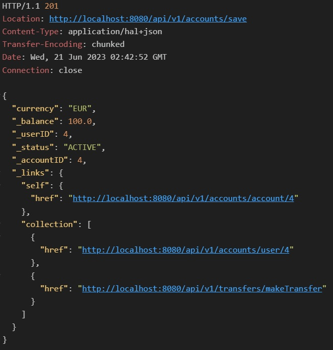
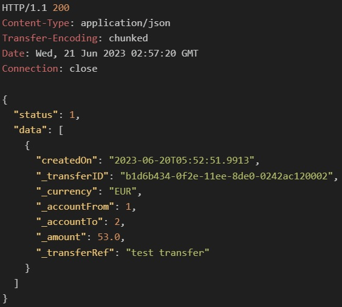
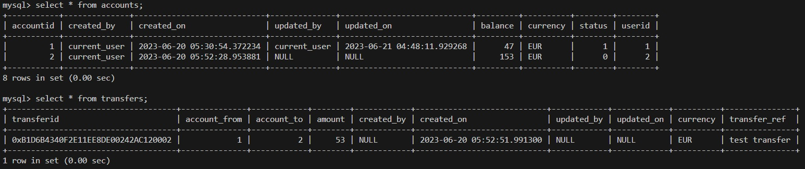

# JavaSpringTest

### Folder Structure
- Java API: source code
- Docker: 
- - AATransferAPI.jar
- - Dockerfile for JAR image
- - docker-compose.yml
- - db_init_script.sql 
- - curlAPItest.sh

1. copy Docker file to linux machine
2. cd to Docker file
3. docker build -t myapi:1.0 .
4. docker-compose up
5. wait for db to initialize and confirm containers are in running state
6. bash curlAPItest.sh

### Account to Account Transfer Java API
In this Spring Boot REST API, the concept of transferring funds between accounts is implemented. This system is assumed to handle internal accounts, and transfers in the same currency. The API handles Account creation, viewing and update requests and Transfers creation and viewing requests. The underlying business logic, handles data validation checks and audits.

Technologies used:

    Spring Boot: development of REST API
    Spring Data JPA: simplifies coding of data access layer
    Hibernate Framework: simplifies developing from Java classes to database tables and also provides data querying and retrieval facility
    Spring HATEOAS: eases creation of links embedded in JSON that makes the API "RESTful"
    MySQL: Persistent storage for accounts and transfers, stored procedures for transfer processing and retrieval
    Docker: Standalone server app together with an image of MySQL

### Domain Model
As a proof of concept, the architecture is kept simple. The server manages incoming requests in the Controller layer. This controller class contains request handler methods which are giving output as HAL+JSON and HTTP code by using ResponseEntity. The Service layer decouples the repository from the controller. Changing the database tool will only require alterations to the Repository layer. The Repository Interface extends the JpaRepository interface for persistence operation performed on the database. 

<br></br><br></br>

### Entity Model
The Account interface defines an account. The Audit class encapsulates common audit requirements such as creation/update dates/users. The Audit class is instantiated in the Account class to track logs, which data is stored automatically in the accounts table.

<br></br><br></br>

## API Specification
### Account Retrieve Operation-Get All
- GET Request URI: /api/v1/accounts
- Desc: Retrieve information of all accounts
- Response status code: 
- - 200 OK if response contains data
- - 204 Not Content
- Response body: JSON document represents information of all accounts details and with HATEOAS, the response includes possible further related actions, in form of links.

### Account Retrieve Operation-Get One
- GET Request URI: /api/v1/accounts/account/{id}
- Desc: Retrieve information of a specified account by account ID

- GET Request URI: /api/v1/accounts/user/{id}
- Desc: Retrieve information of a specified account/s by user ID

- Response status code: 
- - 200 OK if response contains data
- - 404 Not Found if no account found with the given ID
- Response body: JSON document represents information of account

<br></br>

- Requests which return no data have a message indicating this.

<br></br>

### Account Create Operation
- POST Request URI: /api/v1/accounts/save
- Desc: Add new account information
- Request body: JSON document represents information of new account: User ID, amount, currency.
- Response status code: 
- - 200 OK if response contains data
- - 501 Not Implemented if the account failed to be created
- Response body: JSON document of newly added account
<br></br><br></br>

### Account Update Operation
- PATCH Request URI: /api/v1/accounts/account/block?id={id}
- Desc: Update status of an existing account to blocked.
- PATCH Request URI: /accounts/account/reactivate?id={id}
- Desc: A blocked account can be reactivated.
- PATCH Request URI: /accounts/account/close?id={id}
- Desc: Update status of an existing account to closed.
- Response status code: 
- - 200 OK if response contains data
- - 404 Not Found if no account found with the given ID
- Response body: JSON document of updated account

- Accounts with blocked or closed statuses have different links for different actions, such as:

<br></br>

- A closed account cannot be updated and the available links help indicate this.

<br></br>

### Transfers Retrieve Operation-Get All
- GET Request URI: /api/v1/transfers
- Desc: Retrieve information of all transfers
- Response status code: 
- - 200 OK if response contains data
- - 204 Not Content
- Response body: JSON document represents information of all transfers details and with HATEOAS, the response includes possible further related actions, in form of links.

<br></br>

### Transfer Retrieve Operation-Get One
- GET Request URI: /api/v1/transfers/account/{id}
- Desc: Retrieve transfers specified by account ID

- GET Request URI: /api/v1/transfers/account/{id}
- Desc: Retrieve transfers specified by user ID

- Response status code: 
- - 200 OK if response contains data
- - 204 Not Content
- Response body: JSON document represents information of transfers

### Transfer of Funds Operation
- POST Request URI: /api/v1/transfers/makeTransfer
- Desc: Create a transfer
- Request body: JSON document represents information of the transfer: ID of From and To accounts, amount, and transfer description.
- Response status code: 
- - 200 OK if response contains data
- - 501 Not Implemented if the transfer failed to be created
- Response body: message indicating transfer successful

<br></br>

- Updated accounts after transfer.

<br></br>

### Implementation
<ul>
<li>The entity classes, Account and Transfer represent the entities, and with Hibernate, are converted into table, were annotations define the column requirements, data validation and primary keys.</li>
<li>An Audit class is instantiated in the Account class to log data creation and changes. This audit data is incorporated in the accounts table itself.</li>
<li>For the Transfer class, UUID type is used as PK, as it is a stronger unique mechanism when scaling out.</li>
<li>Requests are handled by the Controller classes. After processing the requests, data returned from the service layer is verified so the appropriate response can be built and returned.</li>
<li>The REST client can follow the links included in the response to navigate resources without prior knowledge of links. This decouples client and server as developers can evolve APIs without worrying about breaking clients.</li>
<li>HAL(Hypertext Application Language) expresses links in the JSON response body.</li>
<li>The Account Service Class defines any business logic necessary and acts as a layer between the controller and DB interface.</li>
<li>The Account Repository interface extends methods from JPA Repository interface to perform CRUD operations.</li>
<li>The Account Model Assembler class prepares HATEOAS links to adds links to the response to assist with API navigation. It also checks the account status to decide which links are relevant to include.</li>
<li>A MySQL database is used to persist data.</li>
<li>A Docker image is built from the JAR. The docker-compose spins the server image and the MySQL image which includes also the DB initialization script</li>
</ul>

### Implementation Decisions
- After implementing the API skeleton, i.e. initial domain model, DB interface and communication to/from server, more API and logic features were implemented. The Audit class is instantiated in Accounts with @Embedded annotation. As a result, audit information monitored with @PrePersist and @PreUpdate, is embedded with the account details and mapped to the same accounts table.
<br></br>

- Extra thought and effort is put in transfers mechanism of this API. The trail of thought was to implement best concurrency practices for when multiple transfers need to be processed fast and accurate. Developing a reliable query to effect a transfer proved cumbersome with Hibernate, so stored procedures are used instead for explicit control. 

- The money transfer stored procedure works as follows:
<ul>
<li>SELECT ... FOR UPDATE, UPDATE and INSERT are all executed in one transaction scope. Any query failures will rollback so dirty data is prevented.</li>
<li>If any check fails, the transaction is rolled back and failure message output as a parameter.</li>
<li>The From account is checked for balance and status = Active. </li>
<li>The To account is checked for status = Active and the currency matching the From account. </li>
<li>SELECT ... FOR UPDATE will lock the record with a write (exclusive) lock and ensure that it's not modified until the UPDATE and also when the transaction is completed (</li>committed or rolled back).</li>
<li>Any concurrent account reads will wait until latest data is refreshed.</li>
<li>Thereafter, accounts have their amounts updated and a transfer record is inserted.</li>
</ul>

```SQL
DROP PROCEDURE IF EXISTS sp_MakeTransfer;

CREATE PROCEDURE sp_MakeTransfer (IN ext_account_from bigint,
                                  IN ext_account_to bigint,
                                  IN ext_amount double,
                                  IN ext_transfer_ref varchar(255),
                                  IN ext_created_on datetime(6),
                                  OUT message varchar(200))

sp:  BEGIN

    DECLARE account_from bigint;
    DECLARE balance_from double; # set this with select and use for update to confirm amount did not change by another transaction
    DECLARE account_to bigint;
    DECLARE balance_to double;
    DECLARE currency_from varchar(10);

    # prepare message if transaction (any of the below queries) fail
    SET message = 'Transfer unsuccessful!';

      START TRANSACTION;
        Select accountid, currency, balance into account_from, currency_from, balance_from
        from accounts
        where accountid = ext_account_from
        and balance >= ext_amount
        and status = 0 # ACTIVE
        FOR UPDATE;

        IF account_from IS NULL THEN
            SET message = 'From account not valid for transfer.';
            ROLLBACK; # to cancel select for update
            LEAVE sp;
        END IF;

        Select accountid, balance into account_to, balance_to
        from accounts
        where accountid = ext_account_to
        and status = 0 # ACTIVE
        and currency = currency_from
        FOR UPDATE;

        IF account_to IS NULL THEN
            SET message = 'To account not valid for transfer.';
            ROLLBACK;
            LEAVE sp;
        END IF;

        update accounts set balance = balance - ext_amount where accountid = account_from and balance = balance_from;
        update accounts set balance = balance + ext_amount where accountid = account_to and balance = balance_to;
        insert into transfers(transferid, account_from, account_to, amount, currency, transfer_ref, created_on)
                    values (UUID_TO_BIN(UUID()), ext_account_from, ext_account_to, ext_amount, currency_from, ext_transfer_ref, ext_created_on);
    COMMIT;

    SET message = 'Funds successfully transferred.';

END;
```
- Two more transfer related API resources are also implemented directly as stored procedures, "get transfers by account / for user". MySQL's documentation suggests using LOCK IN SHARE MODE, which gives more precision to read the latest data and wait for any update transactions to commit or rollback. Refreshing the latest data when requesting transfers data is regarded important for reporting / real time purposes. In contrast to the Account querying implementation and in a real world scenario, requesting the latest account details could sufficiently be handled with JPA itself.

- An Init DB script referenced in docker-compose.yml loads the stored procedures and foreign key constraints to ensure referential integrity between accounts and transfers tables. 

- Transfer PUT and DELETE are not implemented. These features should not be allowed.
- Account DELETE is not implemented. Instead, the client can change status to Closed.

- Option<T> is used when returning one object from the methods in the Repository Interfaces. Its Optional.isempty() method is less verbose then checking for null by whoever is calling these methods. Also Optional.empty() is preferred to handle a null object. Such cases are used in commonResponse() method in AccountController.


### Implementation hurdles and further development

- The Audit class embedded in the Transfer entity was later removed. Transfer records cannot be updated so half the audit information is redundant. Additionally, transfers are inserted in the DB with a stored procurer not with JPA, so the embedded data could not be transferred.

- Audit data is retrieved with every account as an embedded object by the repository interface. After countless tries, this information could not be output in the JSON response. 

- Account type as an enum is not implemented for simplicity, yet the concept is similar to status attribute.

- Initially, Account and user were implemented with primary key of type UUID but then were switched to Long as it was cumbersome to test the API requests with UUID. 

- The JPA method .findAll() is exposed for testing purposes. This is not ideal as requesting large amounts of data can stall the server. A solution could be to use pagination.

- Enums are used to represent account status. Problems identified: 
- - If the list changes (adding/reordering) : JPA offers solutions although rather complex.
- - How to expose the list to the client: A simple way to overcome this was to create routes in the AccountController for each status, then calling a common method for all types of status updates. For these routes, query parameter is used instead of request parameter, to differentiate a partial update from the rest of the requests. 

- JPA is not straight forward with developing DB communication. It facilitates common CRUD requests but proved tricky when having enum data types and stored procedures with an output parameter and result set.

- Implementing a relationship constraint with code between the Account and Transfer Entity is not possible with this domain model. Relationships annotations require the child entity to be a collection in the parent entity. In this application, both entities are parents. Foreign key constraints are then implemented with SQL.

- Implementing GET transfers by user ID proved cumbersome to implement with code. Transfer table has to be joined with account table on To/From account IDs, to get to the user ID. One possible solutions is to inject IAccountRepository in the ITransferRepository and query the accounts related to the user ID. This doesn't seem to be the ideal way to develop a robust API though. 

- Resorting to stored procedures to GET transfers by user ID and GET transfers by account ID, solved half the problem, that of reading committed data. Then, JPA could not properly execute these two stored procedures and these routs do not return data.

- HATEOAS links are not implemented for Transfer entity as I was not sure what links would be relevant. Yet the concept is proved in the Account response.

- At a later development stage, it was noticed that the way the API is designed, it cannot handle enriching the transfers data as extra columns won't match the transfers entity attributes. Perhaps there is a flexible mechanism allowing variable result sets to be returned by the repository interface. 

- Did not focus on DB security, such as granting limited permissions for DB User for the API.

- Better understanding and implementation of exception handling in controller classes.