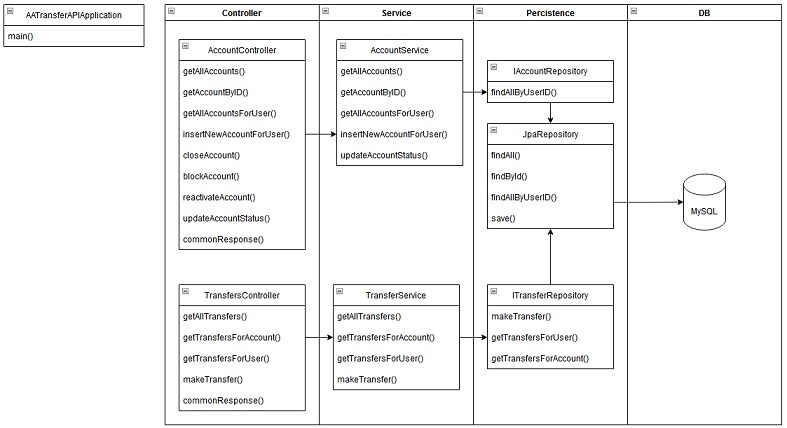
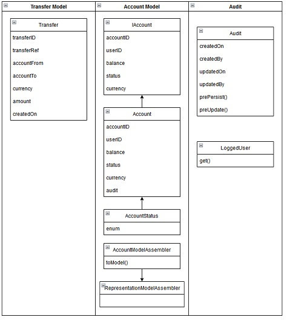
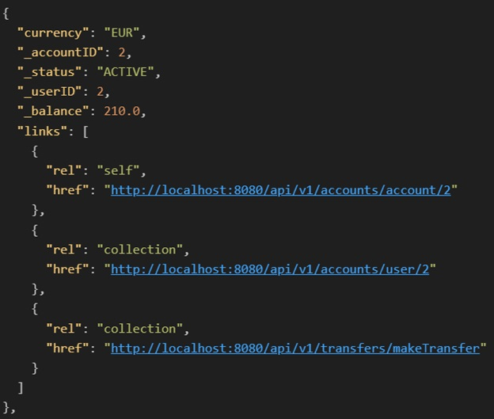
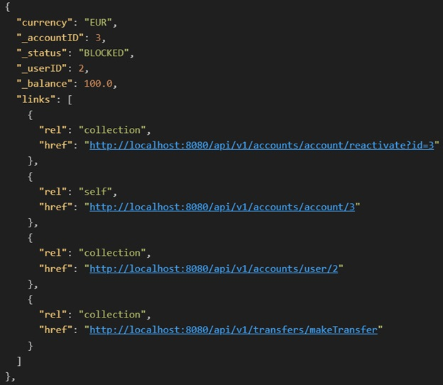
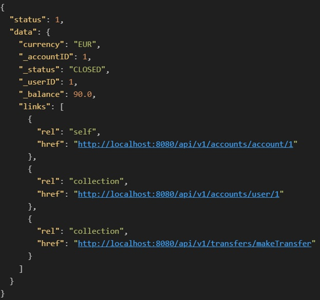
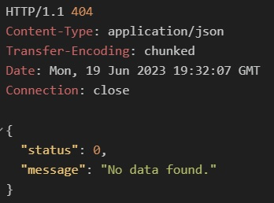
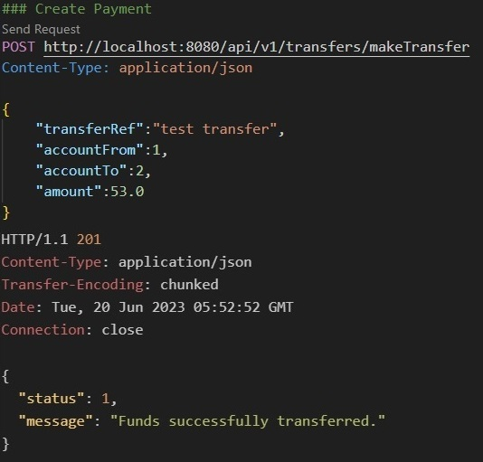
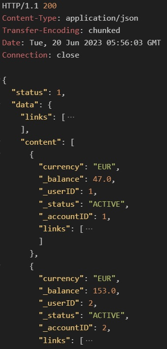

# JavaSpringTest

<h3 style="color:cyan">Account to Account Transfer</h3>
In this Spring Boot REST API, the concept of transferring funds between accounts is implemented. This system is assumed to handle internal accounts, and transfers of same currency. Accounts can be created, viewed and updated. Simple auditing is incorporated in the Accounts entity. Transfers between accounts can be created and requested. The underlying business logic, handles data validation checks and possibility of transfer.

Technologies used:

    Spring Boot: development of REST APIs with minimal configurations
    Spring Data JPA: simplifies coding of data access layer
    Hibernate Framework: simplifies developing from Java classes to database tables and also provides data querying and retrieval facility
    Spring HATEOAS: eases creation of links embedded in JSON that makes the API "RESTful"
    MySQL: persistent storage for accounts and transfers, stored procedures for transfer processing and retrieval
    Docker: Standalone server app together with an in image of MySQL

<h3 style="color:cyan">Domain Model</h3>
- As a proof of concept, the architecture is kept simple. The server manages incoming requests in the Controller layer. This controller class contains request handler methods which are giving output as HAL+JSON and HTTP code by using ResponseEntity. The Service layer decouples the repository from the controller. Changing the database tool will only require alterations to the Repository layer. The Repository Interface extends the JpaRepository interface for persistence operation performed on the database. 

<br></br><br></br>

<h3 style="color:cyan">Entity Model</h3>
- An Account interface defines the account for future implementations, if a new product is to be added. The Audit class encapsulates common audit requirements such as creation/update dates/users. The Audit class is instanciated in the Account class to track logs, which data is stored automatically in the accounts table.
<br></br><br></br>

<h3 style="color:Khaki">Account Retrieve Operation-Get All</h3>
- GET Request URI: 
- Retrieve information of a specified account by ID
- The response for account details request shows the data to the client and with HATEOAS, the response includes possible further related actions, in form of links.
- Response status code: 
- - 200 OK if response contains data
- - 404 Not Found if no account found with the given ID
- Response body: JSON document represents information of all accounts
<h3 style="color:Khaki">Account Create Operation</h3>
- POST Request URI: 
- Add new account information
- Request body: JSON document represents account information
- Response status code: 
- - 200 OK if response contains data
- - 404 Not Found if no account found with the given ID
- Response body: JSON document of newly added account
<br></br><br></br>
- Accounts with blocked or closed statuses have different links for different actions, such as:
- A blocked account can be reactivated.
- PATCH Request URI: 
- Update partial information of an existing account
- Request body: JSON document represents account information
- Response status code: 
- - 200 OK if response contains data
- - 404 Not Found if no account found with the given ID
- Response body: JSON document of newly added account
<br></br><br></br>
- A closed account cannot be updated.
<br></br><br></br>
- Requests which return no data have a message indicating this.
<br></br><br></br>
- Response of money transfer.
<br></br><br></br>
- Updated Accounts.

- Request body:  Transfer expects from and two accounts, amount, and transfer description.
<br></br><br></br>

<h3 style="color:cyan">Implementation</h3>
<ul>
<li>To showcase money transfers between accounts, the API handles account creation and update requests and transfers between account.</li> 
<li>The Account entity class holds basic details, link to user and auditing. With Hibernate, the class is converted into a table, were annotations define the column requirements, data validation and primary key.</li>
<li>An Audit class is instantiated in the Account class to log creation and changes. This data is incorporated in the accounts table itself.</li>
<li>Requests are handled by the Account Controller class. Data returned from the business logic layer is verified so the appropriate response can be created and returned.</li>
<li>The Account Service Class defines any business logic necessary and acts as a layer between the controller and DB interface.</li>
<li>The Account Repository interface extends methods from JPA Repository interface to perform CRUD operations</li>
<li>The Account Model Assembler class prepares HATEOAS links to adds links to the response to assist with API navigation. It also checks the account status to decide which links are relevant to include. </li>
</ul>

<ul>
<li>The Transfers class defines basic transfer details. Hibernate annotations validate data at the application level. The class attributes define the table created with Hibernate.</li>
<li>UUID was used as PK as it is a stronger unique mechanism when scaling out.</li>
<li>Stored procedures are used over JPA methods for control and performance.</li>
</ul>

<ul>
<li>HATEOAS: from a base URI like /v1/api/accounts, REST client can follow the links included in the response to navigate resources without prior knowledge of links.</li>
<li>Decouples client and server as developers can evolve APIs without worrying about breaking clients.</li>
<li>HAL(Hypertext Application Language) expresses links with JSON</li>
</ul>

<ul>
<li>A MySQL database is used to persist data.</li>
</ul>

<ul>
<li>The API as a JAR build in Dockerfile.</li>
<li>Docker compose file for JAR and MySQL. Includes SQL init script</li>
<li>Bash test script</li>
</ul>

<h3 style="color:cyan">Implementation Decisions</h3>
After implementing the API skeleton, i.e. initial domain model, DB interface and communication to/from server, more API and logic features were implemented included. The Audit class is instantiated in Accounts with @Embedded annotation. As a result, audit information monitored with @PrePersist and @PreUpdate, is embedded with the account details and mapped to a single database table.

Extra thought and effort is put in transfers mechanism of this API. The trail of thought was to implement best practices if multiple transfers need to be processed fast and accurate. Developing a reliable query to effect a transfer proved cumbersome with Hibernate, so stored procedures are used instead for explicit control. 

The money transfer stored procedure works as follows:
<ul>
<li>SELECT ... FOR UPDATE, UPDATE and INSERT are all executed in one transaction scope. Any query failures will rollback so dirty data is prevented. </li>
<li>The From account is checked for balance and status = Active. </li>
<li>The To account is checked for status = Active and the currency matching the From account. </li>
<li>both account selects lock rows for update so any concurrent account read query will wait until latest data is refreshed. </li>
<li>SELECT ... FOR UPDATE will lock the record with a write (exclusive) lock  and ensure that it's not modified until the UPDATE and also when the transaction is completed (</li>committed or rolled back).</li>
<li>if any check fails, the transaction is rolled back and failure message output as a parameter.</li>
<li>Thereafter, accounts have their amounts updated and a transfer record is inserted.</li>
</ul>

```SQL

```
Two more transfer related API resources are also implemented directly as stored procedures, "get transfers by account / for user". MySQL's documentation suggests using LOCK IN SHARE MODE, which gives more precision to read the latest data and wait for any update transactions to commit or rollback. Refreshing the latest data when requesting transfers data is regarded important for reporting / real time purposes. In contrast and in a real world scenario, requesting the latest account details could be sufficiently handled with JPA itself.

An Init DB script referenced in docker-compose.yml loads the stored procedures and foreign key constraints to ensure referential integrity between accounts and transfers tables. 

Transfer PUT and DELETE are not implemented. These features should not be allowed.
Account DELETE is not implemented. Instead, the client can change status to Closed.

Option<T> is used to return single entity result from the methods in the Repository Interfaces. Its Optional.isempty() method is less verbose then checking for null by whoever is calling these methods. Also Optional.empty() is preferred to handle a null object. Such cases are used in commonResponse() method in AccountController.


<h3 style="color:cyan">Implementation hurdles and further dev</h3>

The Audit class embedded in the Transfer entity was later removed. Transfer records cannot be updated so half the audit information is redundant. Additionally, transfers are inserted in the DB by stored procurers not by code.

Audit data for Account GET responses is retrieved correctly although still embedded in the account object. After countless tries, this information could not be output in the JSON response. 

JPA is not straight forward with developing DB communication. It facilitates common CRUD requests but proved tricky when having enum data types and stored procedures with an output parameter and result set.

foreign key constraints which could not be implemented with Hibernate


account type is not implemented although concept similar to status.
focused on
didn't focus on and why
joining tables and relationships
Primary keys are generated by the API. Initially, Account and user were implemented with UUID but then switched to Long as it was cumbersome to test API requests with UUID. 
Did not focus on DB security, such as granting limited permissions for DB User.
The JPA method .findAll() is exposed for testing purposes. This is not ideal as requesting large amounts of data can stall the server. A solution could be to use pagination.
Audits are returned as an embedded. need to expose?
Enums for account status are used. Problem with changing list (adding/reordering), how to expose the list to the client. JPA offers solutions although rather complex. A simple way to overcome was to create routes for each status and a common method for update. here, query parameter was used instead of request parameter to differentiate. 

Limitations: Get transfers by user ID became cumbersome due to requesting user list. implemented as SP. Same concept is implemeted for get by account. JPA could not properly execute these two SPs and these routs do not return data.

HATEOAS links not implemented for transfer, wasn not sure what to add. proved concept with accounts.

Initially  Account and Transfer classes were thought of two separate entities. Trying to implment relational annotaions was impossible as Transfer had to exsist in Account. FKs are implemented in script. 

> The way the API is designed, I cannot return enriched transfer details cause they won't match the transfers class


